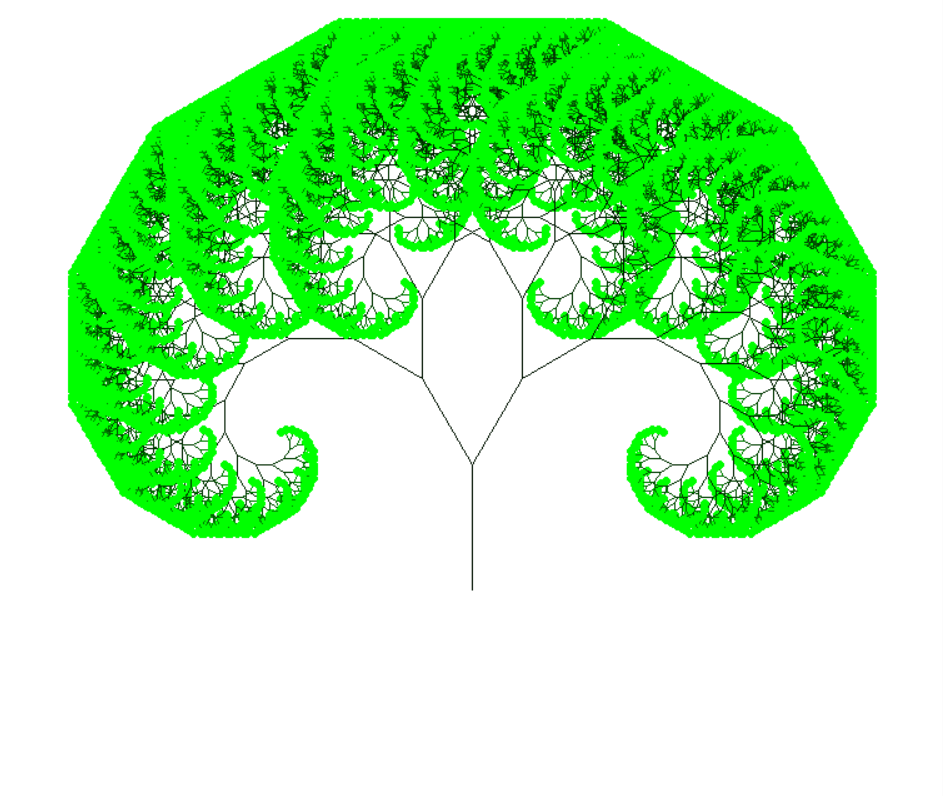
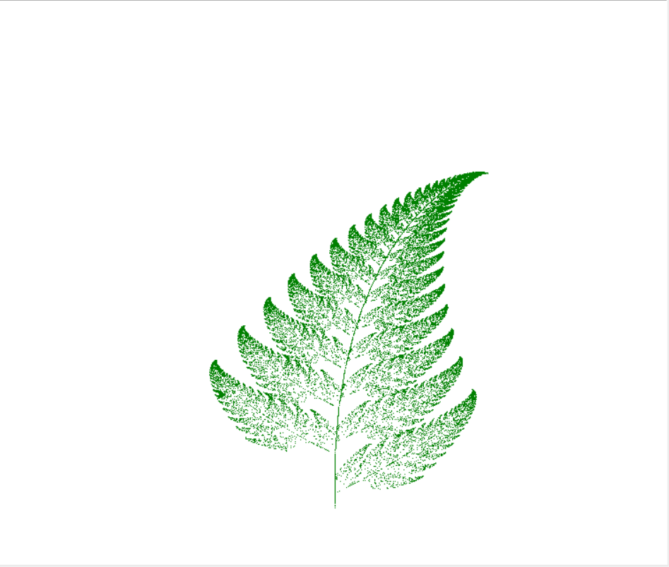
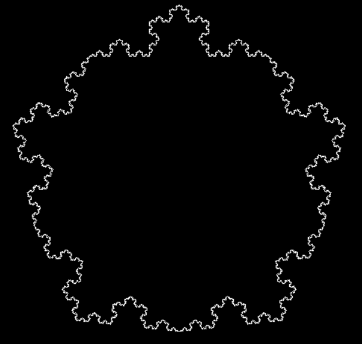

# Fractals

This repo contains code to generate various images called fractals. These images are generated procedurally, 
and the result is an object that is self-similar on an "infinite" level. Although it is impossible to render an object that is infinitely self-similar, a good approximation is possible in a reasonable amount of time.

Here is the result of a few renders:
  

See more renders in the `images` directory. To render these images yourself, you must install the dependencies with the command
`pip install -r requirements.txt`. You must also have the python package `tkinter`, which is an optional package when you install Python on Windows. Furthermore, some of these fractals may take a few minutes to render. Please be patient when running.